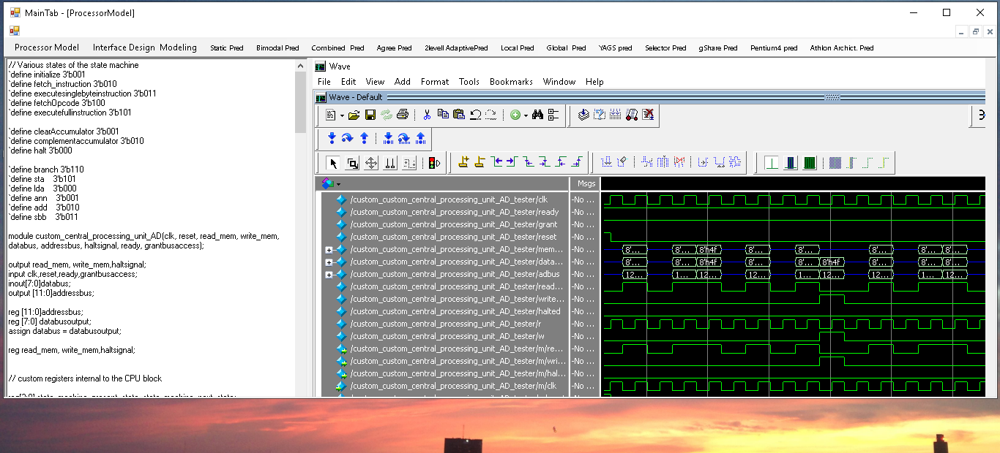
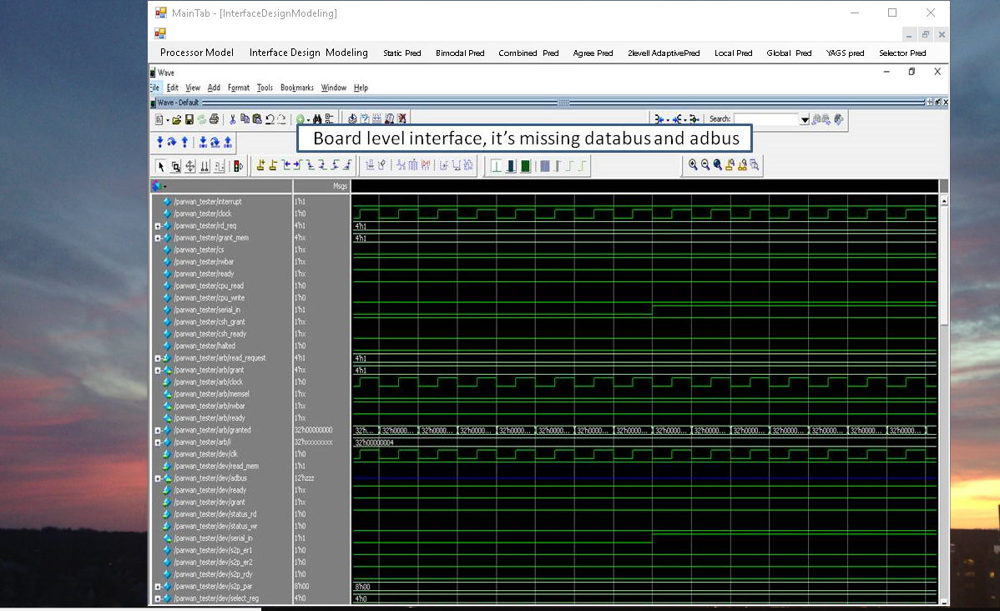
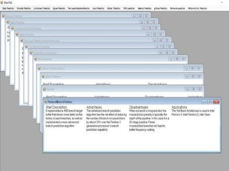
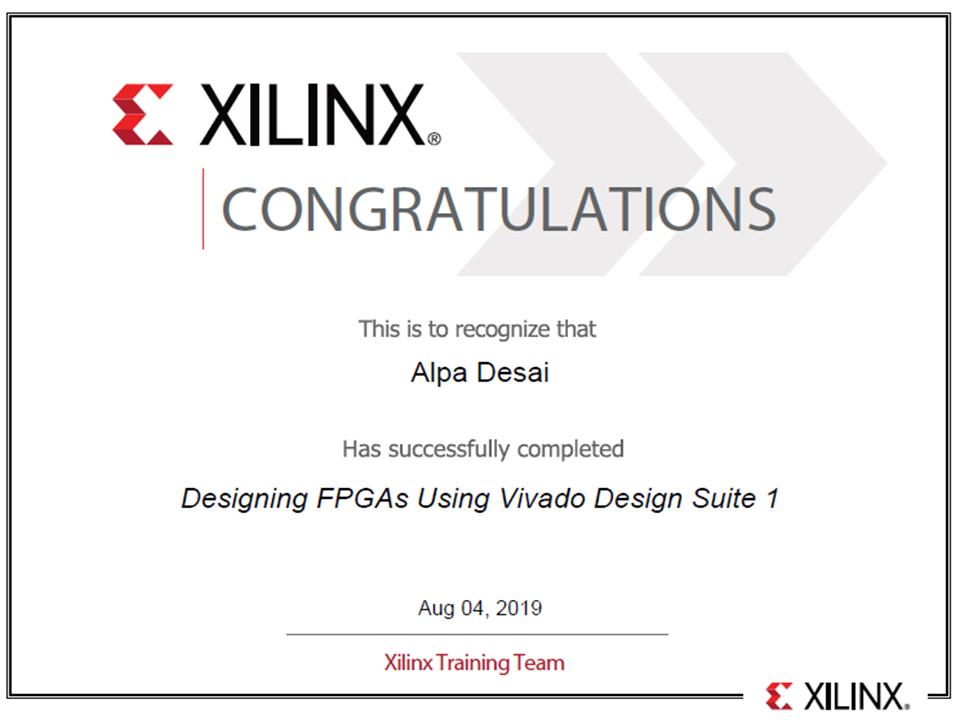

## Computer Architecture

The project consists of analysis of various types of branch predictors. For details launch the executable from https://github.com/alpaddesai/ComputerArchitecture/releases 

All images are either custom by Alpa D Desai or a reference name is included. Most of the images are custom. Copyright protection in progress.Company confidential information is not displayed 

## Custom 8bit processor model

## Board level interface model

## Research on branch predictors

## FPGA design certificate

## Verilog certificate

